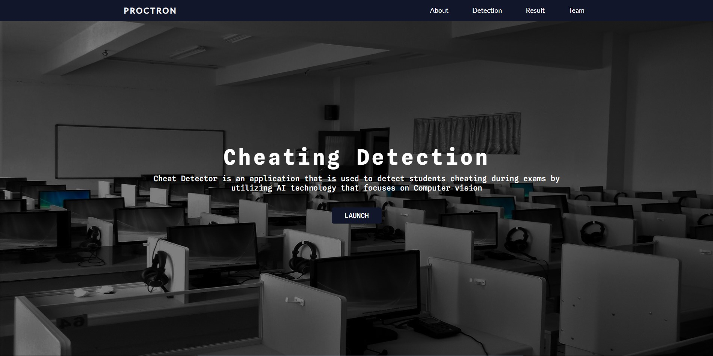
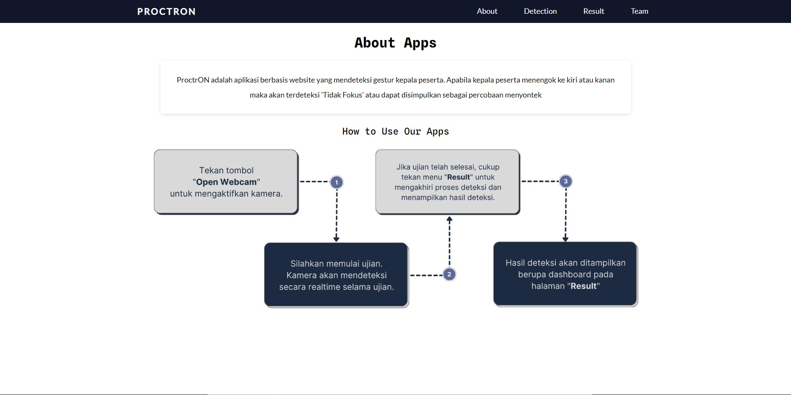
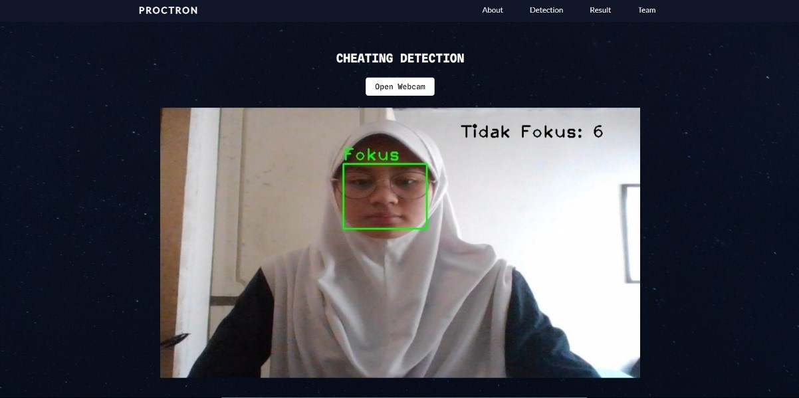
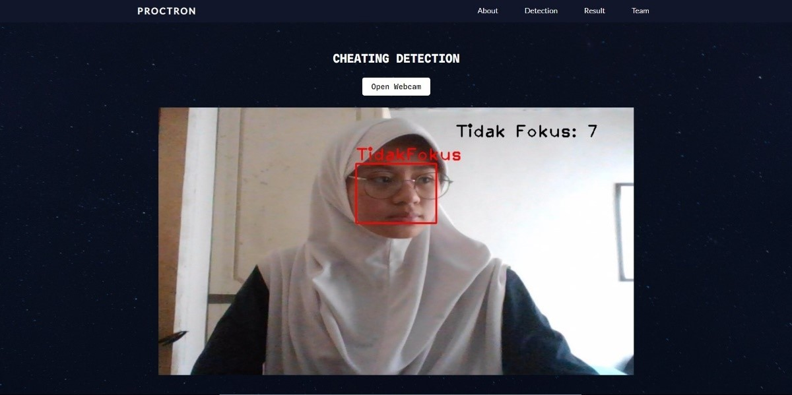
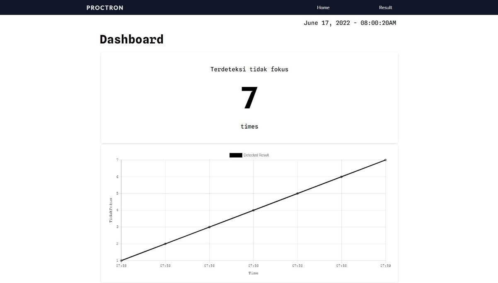
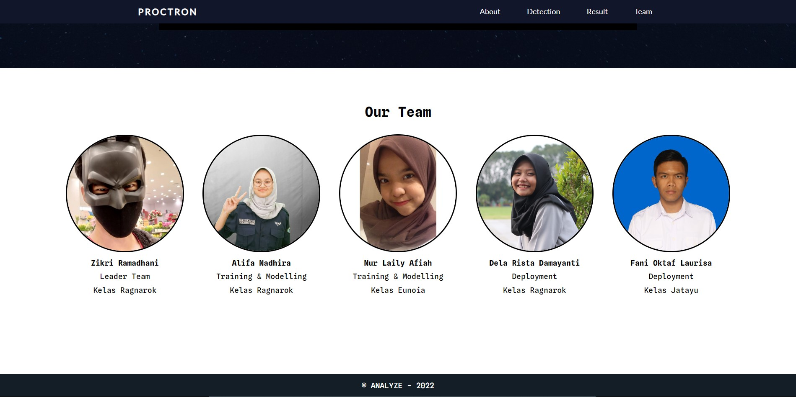

# ProctrON
### Proyek Akhir Studi Independen di OFA - AI Mastery. 

Aplikasi ProctrON adalah aplikasi berbasis website yang mana dapat mendeteksi gesture kepala manusia saat menengok ke kiri atau ke kanan.
Ditujukan untuk deteksi menyontek atau tidak saat ujian. 
Aplikasi ini menggunakan framework YOLOv4 by [Darknet](https://github.com/AlexeyAB/darknet) dengan algoritma CNN.  
Aplikasi ini dikembangkan untuk memenuhi persyaratan proyek akhir studi independen bersertifikat di PT. Orbit Future Academy dengan fokus AI Mastery.

### Dokumentasi Aplikasi Web

#### App Dev:
  - [Zikri Ramadhani](https://github.com/lyleoo) (Leader Team)
  - [Alifa Nadhira P](https://github.com/alifanadhira) (Training & Modelling)
  - [Nur Laily Afiah](https://github.com/lailyafiah) (Training & Modelling
  - [Dela Rista Damayanti](https://github.com/delarista) (Deployment)
  - [Fani Oktaf Laurisa](https://github.com/fandenfraat) (Deployment)

  
&copy;Analyze Team - 2022
